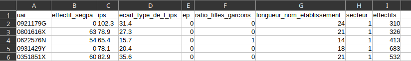
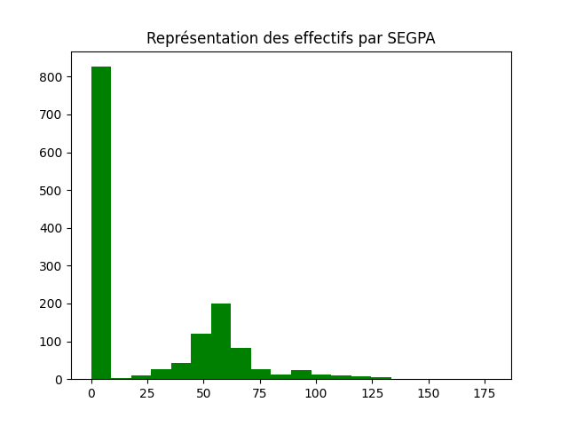
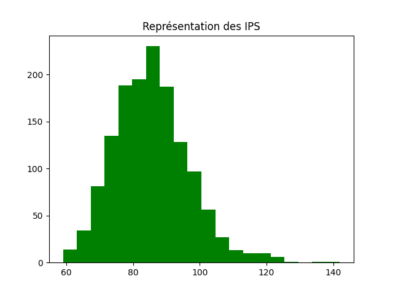
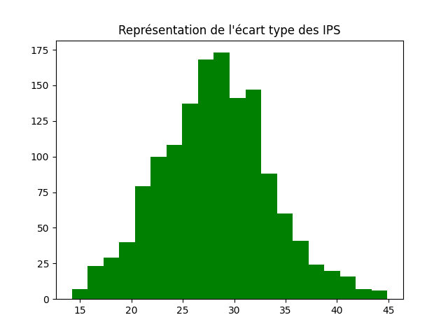
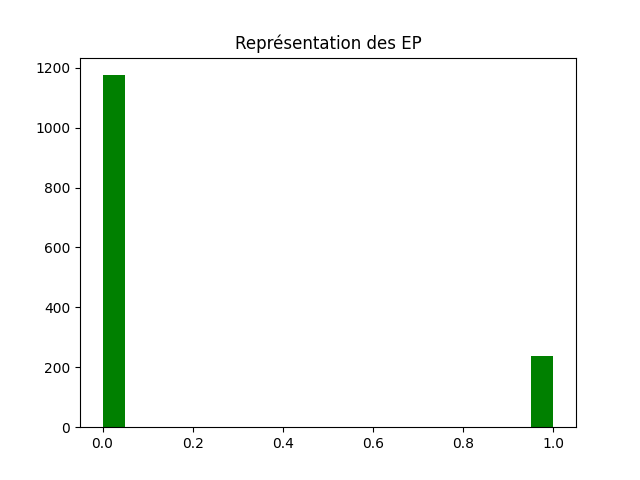
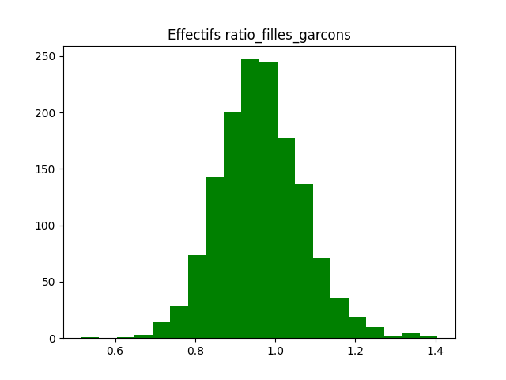
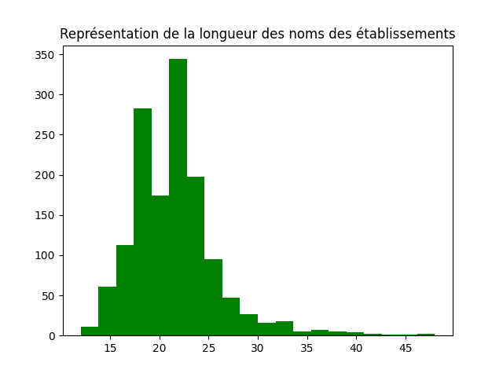
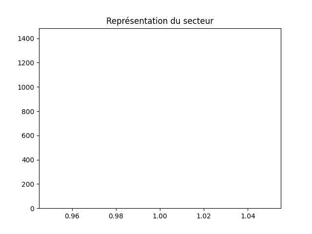
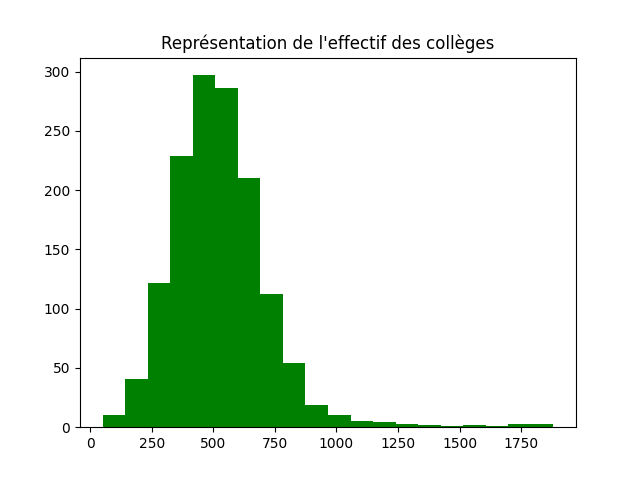

# Compte-rendu partie 3 S2.04
<link rel="stylesheet" href="printed.min.css">
<link rel="stylesheet" href="https://cdn.jsdelivr.net/npm/katex@0.16.10/dist/katex.min.css" integrity="sha384-wcIxkf4k558AjM3Yz3BBFQUbk/zgIYC2R0QpeeYb+TwlBVMrlgLqwRjRtGZiK7ww" crossorigin="anonymous">

<!-- The loading of KaTeX is deferred to speed up page rendering -->
<script defer src="https://cdn.jsdelivr.net/npm/katex@0.16.10/dist/katex.min.js" integrity="sha384-hIoBPJpTUs74ddyc4bFZSM1TVlQDA60VBbJS0oA934VSz82sBx1X7kSx2ATBDIyd" crossorigin="anonymous"></script>

<!-- To automatically render math in text elements, include the auto-render extension: -->
<script defer src="https://cdn.jsdelivr.net/npm/katex@0.16.10/dist/contrib/auto-render.min.js" integrity="sha384-43gviWU0YVjaDtb/GhzOouOXtZMP/7XUzwPTstBeZFe/+rCMvRwr4yROQP43s0Xk" crossorigin="anonymous"></script>

<script src="https://code.jquery.com/jquery-3.7.1.slim.min.js" integrity="sha256-kmHvs0B+OpCW5GVHUNjv9rOmY0IvSIRcf7zGUDTDQM8=" crossorigin="anonymous"></script>

<script>
$(document).ready(function () { // this need jquery
  renderMathInElement(document.body, {
    // ...options...
    delimiters: [
      { left: "$$", right: "$$", display: true },
      { left: "$", right: "$", display: false },
      { left: "\\[", right: "\\]", display: true }
    ]
  });
});
</script>

## Les données Colleges.csv &mdash; Problématique

### (a) Présentation des données

Le fichier Colleges.csv contient plusieurs séries statistiques sur l’ensemble de toutes les collèges répertoriés dans notre base de données :

- IPS du collège
- L'écart-type de l'IPS (inégalités intra-collège)
- Statut EP (le collège est-il dans une ZEP)
  - Non: 0
  - Oui: 1
- Ratio filles/garçons
- Longueur du nom de l'établissement
- Secteur
  - Privé : 0
  - Public : 1
- Effectif du college

+ Variable endogène: effectifs SEGPA dans l'établissement



### (b) Problématique

Parmi les donnéees de notre fichier, certaines peuvent-elles permettre d’expliquer le nombre de collégiens en SEGPA?

##  Import des données, mise en forme

### (a) Importer les données en Python

On importe notre vue sous forme de DataFrame avec la commande suivante :

```python
CollegesDF=pd.read_csv("Colleges.csv")  
```

### (b) Mise en forme

On a besoin de supprimer les cases vides (qui contiennent nan en Pythons), puis on transforme notre DataFrame en Array :

```python
CollegesDF = CollegesDF.dropna()
CollegesAr = CollegesDF.to_numpy()
```

### (c) Centrer-réduire

On ne garde que les colonnes de notre tableau qui contiennent des données numériques, on peut alors centrer-réduire ces données :

```python
def Centreduire(T):
  T = np.array(T,dtype=np.float64) # données ne sont pas de type float donc cette ligne le change
  (n,p) = T.shape
  Moyennes = np.mean(T, 0)
  EquartTypes = np.std(T, 0)
  Res = np.eye(n,p)
  for j in range(p):
          Res[:,j]= (T[:,j]-Moyennes[j])/EquartTypes[j]
  return Res

CollegesAr0 = CollegesAr[:,2:] # tout sauf la clé (uai) et la variable endogène
CollegesAr0_CR = Centreduire(CollegesAr0)
```

## Exploration des données

### (a) représentations graphiques

On choisit d’étudier les diagrammes en bâtons de nos variables statistiques&nbsp;:



On remarque que la plus part des collèges n'ont pas de SEGPA dans l'établissement. Mais parmi ce qui en ont, la parité se trouve entre 45 et 65.



On remarque que la majorité des IPS se situent entre 75 et 90, avec un léger taux entre 100 et 120.



On remarque que l'écart-type des IPS est majoritaire entre 25 et 33. Mais aussi un taux assez élevé entre 18 et 25.



On remarque que la grande majorité des établissements ne se situent pas dans une ZEP (environ 98%).



On remarque que la plupart des collèges sont autour de la parité (entre 45 et 55% de filles), mais certains collèges ont un fort déséquilibre (jusqu’à 2/3 de filles, ou 2/3 de garçons).



On remarque que la longueur du nom des établissements est majoritairement entre 18 et 24.



On remarque que le diagramme n'afiche rien. ~~Donc les secteurs publics et privé ne serait qu'une illusion~~. Les secteurs privé et public ont des valeurs de soient 1 ou 0. Ainsi le bâton est trop petit pour être vu. De plus comme dans notre échantillon de données c'est toujours la même valeur (public), cette variable n'a aucun intérêt.



On remarque que l'effectif des collèges est majoritairement autour de 500.

### (b) Matrice de covariance

#### (a) Démarche

Dans cette partie, on calcule la matrice de covariance afin de trouver les variables explicatives qui sont les plus corrélés avec la variable endogène.

#### (b) Matrice de covariance

On obtient la matrice suivante :

<table class="covar"><style>
  .covar th {
    background-color: #C9CDD080;
  }
  .covar .positive {
    background-color: rgba(0, 187, 0, 0.5);
  }
  .covar .negative {
    background-color: rgba(238, 0, 0, 0.5);
  }
  .covar tbody>tr:nth-of-type(1)>td:nth-of-type(1){background-color:#9296FD80;}.covar tbody>tr:nth-of-type(2)>td:nth-of-type(2){background-color:#9296FD80;}.covar tbody>tr:nth-of-type(3)>td:nth-of-type(3){background-color:#9296FD80;}.covar tbody>tr:nth-of-type(4)>td:nth-of-type(4){background-color:#9296FD80;}.covar tbody>tr:nth-of-type(5)>td:nth-of-type(5){background-color:#9296FD80;}.covar tbody>tr:nth-of-type(6)>td:nth-of-type(6){background-color:#9296FD80;}.covar tbody>tr:nth-of-type(7)>td:nth-of-type(7){background-color:#9296FD80;}
</style><thead><tr style="text-align:right;"><th></th><th>IPS</th><th>Écart-type de l'IPS</th><th>Statut EP</th><th>Ratio filles/garçons</th><th>Longueur du nom</th><th>Secteur</th><th>Effectif</th></tr></thead><tbody><tr><th>IPS</th><td class="positive">1.000708</td><td class="positive">0.824974</td><td class="positive">0.383091</td><td class="negative">-0.026954</td><td class="negative">-0.018500</td><td class="zero">0</td><td class="negative">-0.024244</td></tr><tr><th>Écart-type de l'IPS</th><td class="positive">0.824974</td><td class="positive">1.000708</td><td class="positive">0.297621</td><td class="negative">-0.026673</td><td class="negative">-0.020049</td><td class="zero">0</td><td class="positive">0.019536</td></tr><tr><th>Statut EP</th><td class="positive">0.383091</td><td class="positive">0.297621</td><td class="positive">1.000708</td><td class="negative">-0.017669</td><td class="negative">-0.030937</td><td class="zero">0</td><td class="positive">0.055533</td></tr><tr><th>Ratio filles/garçons</th><td class="negative">-0.026954</td><td class="negative">-0.026673</td><td class="negative">-0.017669</td><td class="positive">1.000708</td><td class="negative">-0.022358</td><td class="zero">0</td><td class="positive">0.005693</td></tr><tr><th>Longueur du nom</th><td class="negative">-0.018500</td><td class="negative">-0.020049</td><td class="negative">-0.030937</td><td class="negative">-0.022358</td><td class="positive">1.000708</td><td class="zero">0</td><td class="positive">0.053575</td></tr><tr><th>Secteur</th><td class="zero">0</td><td class="zero">0</td><td class="zero">0</td><td class="zero">0</td><td class="zero">0</td><td class="zero">0</td><td class="zero">0</td></tr><tr><th>Effectif</th><td class="negative">-0.024244</td><td class="positive">0.019536</td><td class="positive">0.055533</td><td class="positive">0.005693</td><td class="positive">0.053575</td><td class="zero">0</td><td class="positive">1.000708</td></tr></tbody></table>

## Régression linéaire multiple

### (a) Utilisation de la Régression linéaire multiple&nbsp;: comment ?

En choisissant la première variable statistique comme variable endogène et certaines des autres variables comme variables explicatives, la régression linéaire multiple nous permet d’obtenir une estimation de l'effectif des SEGPA par établissement dans les collèges en fonction d’autres informations sur ces collèges.

### (b) Variables explicatives les plus pertinentes

Notre objectif est de trouver des variables qui expliquent le mieux possible la variable endogène.

Nous avons obtenu les coefficients suivants&nbsp;:

Variable|Coefficient
-|-
IPS|-0.17970087899974915
Écart-type de l'IPS|0.035986983712883766
Statut EP|0.03342566048362304
Ratio filles/garçons|-0.15523048962821243
Longueur du nom|-0.010659238275952923
Secteur|0.0
Effectif|0.3227263623366192

Ainsi les variables explicatives les plus pertinentes seraient l'effectif, l'IPS et ratio filles/garçons. Ces deux dernier influencent tous négativement la variable endogène.

On peut en interpréter&nbsp;:

1. Plus l'effectif du collège est élevé, plus il y a de SEGPA
2. Plus l'IPS du collège est élevé, moins il y a de SEGPA
3. Plus le ratio filles/garçons est élevé (plus il y a de filles), moins il y a de SEGPA

On remarque notamment&nbsp;:

1. Le secteur n'a aucune influence. Cela s'explique par le fait que tous les établissements dans l'échantillon de données sont publics. L'écart-type de cette variable étant nul, elle n'a auucune influence sur la variable endogène.

### (c) Lien avec la problématique

Les paramètres de la régression linéaire multiples nous informent que l'effectif, l'IPS et ratio filles/garçons sont des valeurs explicatives qui influencent l'effectif de SEGPA par établissement.

En calculant le coefficient de corrélation multiple, on saura de plus si cette influence permet de prédire la réalité, on saura ainsi ce qui influence réellement l'effectif de SEGPA par établissement.

### (d) Régression Linéaire Multiple en Python

On fait maintenant la régression linéeaire multiple avec Python&nbsp;:

```python
linear_regression = LinearRegression()
x, y = CollegesAr0_CR, CollegesAr_CR[:, 0]
linear_regression.fit(x, y)
regression_coefs = linear_regression.coef_
regression_score = linear_regression.score(x, y)
```

### (e) Paramètres, interprétation

On obtient les paramètres&nbsp;:

$$
\begin{align*}
a_0 &= -0.17970087899974915 \\\\
a_1 &= 0.035986983712883766 \\\\
a_2 &= 0.03342566048362304 \\\\
a_3 &= -0.15523048962821243 \\\\
a_4 &= 0 \\\\
a_5 &= -0.010659238275952923 \\\\
a_6 &= 0.3227263623366192 \\\\
\end{align*}
$$

Le signe du paramètre $a_0$ nous permet de voir que la variable $X_0$ (IPS) influence **négativement** la variable endogène.

Le signe du paramètre $a_1$ nous permet de voir que la variable $X_1$ (Écart-type de l'IPS) influence **positivement** la variable endogène.

Le signe du paramètre $a_2$ nous permet de voir que la variable $X_2$ (Statut EP) influence **positivement** la variable endogène.

Le signe du paramètre $a_3$ nous permet de voir que la variable $X_3$ (Ratio filles/garçons) influence **négativement** la variable endogène.

Le signe du paramètre $a_4$ nous permet de voir que la variable $X_4$ (Longueur du nom) influence **nullement**  la variable endogène.

Le signe du paramètre $a_5$ nous permet de voir que la variable $X_5$ (Secteur) influence **négativement** la variable endogène.

Le signe du paramètre $a_6$ nous permet de voir que la variable $X_6$ (Effectif) influence **positivement** la variable endogène.

Les variables endogène et explicatives étant centrées-réduites, la valeur absolue de chaque paramètre quantifie son influence sur la variable endogène. Classement des variables explicatives par influence décroissante&nbsp;:

\#|Paramètre|Coefficient|Variable
-|-|-|-
1|$a_6$|0.3227263623366192|Effectif
2|$a_0$|-0.17970087899974915|IPS
3|$a_3$|-0.15523048962821243|Ratio filles/garçons
4|$a_1$|0.035986983712883766|Écart-type de l'IPS
5|$a_2$|0.03342566048362304|Statut EP
6|$a_4$|-0.010659238275952923|Longueur du nom
7|$a_5$|0|Secteur

### (f) Coefficient de corrélation multiple, interprétation

Coefficient de corrélation (*regression_score*)&nbsp;: &asymp; 0.702 &rarr; corrélation faible.

La corrélation est faible. Cela dit, le coefficient reste assez élevé. Nous estimons avoir été pertinents dans nos choix de variables.

## Conclusions

### (a) Réponse à la problématique

Comme nous l'avons vu, les variables influençant le plus le nombre d'élèves en SEGPA sont l'effectif, l'IPS et ratio filles/garçons.

### (b) Argumentation à partir des résultats de la régression linéaire

On introduit la fonction de prédiction&nbsp;:

```python
def y_pred(i):
  return regression_coefs * CollegesAr0_CR[i]
```

Ensuite, on calcule sa performance en faisant quelques tests. Résutats &nbsp;:

Différence moyenne entre $Y$ et $Y_pred$&nbsp;: -8.092104701232687e-17

> Une valeur très proche de 0, ce qui témoigne de la performance de cette régréssion dans le cas général.

Différence médiane entre $y$ et $Y_pred$&nbsp;: 0.3181462327443442

> Une valeur très grande comparé à la moyenne, ce qui montre qu'il y a des valeurs aberrantes qui ne correspondent pas au paramètres de la régression.

Conclusion sur cette régression linéaire&nbsp;: des résultats pertinents, mais on pourrait approfondir plus, notamment en touchant à d'autres variables. Il faudrait aussi un échantillon plus grand. Un effectif de 1000, c'est très peu&nbsp;: en fonction de la nature des données, on peut avoir besoin d'un effectif de l'ordre de $10^5$, voire $10^6$.

Ce qu'il faut retenir, c'est que plus l'échantillon est grand, plus les données seront fiables et cohérentes, notamment grâce à la loi des grand nombre, qui contrôle l'influence des valeurs aberrantes en les noyant dans la masse de données.

### (c) Interprétations personnelles

Pour rappel&nbsp;: une classe <abbr title="Section d'enseignement général et professionnel adapté">Segpa</abbr> accueille les jeunes de la 6<sup>e</sup> à la 3<sup>e</sup> présentant des difficultés scolaires importantes. Il s'agit de difficultés ne pouvant pas être résolues par des actions d'aide scolaire et de soutien.

La classe est intégrée dans un collège. Elle regroupe un petit groupe d'élèves (16 maximum) pour individualiser le parcours de chacun.

#### Effectif

Les plus grands collèges se trouvent dans les grandes villes (chefs-lieu, métropoles), qui accueillent en général plus d'individus modestes que dans les les villes moyennes ou les campagnes. On rejoint alors l'explication pour la variable IPS (voir ci-après).

De plus, les plus grands collèges sont plus nombreux à disposer de classes SEGPA, par principe d'économie d'échelle et de réponse au besoin existant, qui se trouve, comme établi, plus dans les grandes villes.

#### IPS

L’indice de position sociale (IPS) permet d’appréhender le statut social des élèves à partir des professions et catégories sociales (PCS) de leurs parents.

Un plus faible IPS indique un statut social des élèves plus modeste. Ceux-ci sont plus enclins à avoir des difficultés scolaires que les plus riches, pour plusieurs raisons&nbsp;:

- la difficulté à se concentrer pour les devoirs (famille nombreuse / petit logement)
- peu de recours familiaux pour obtenir de l'aide (parents non qualifiés)
- du fait de la précarité financière du foyer, pas de possbilité d'avoir un tuteur / cours particuliers / soutien

#### Ratio filles/garçons

Cette variable est la seule des 3 à avoir un coefficient négatif, ce qui signifie que plus il y a de filles, moins il y a d'élèves en SEGPA.

Cette différence pourrait se constater par rapport à ce que les filles développent plus tôt leur puberté que les garçons. Ainsi, cela peut se refléter sur leur capacité académique. Certains garçons peuvent avoir besoin de plus de temps pour atteindre certains objectifs académiques. 

Le comportement peut également avoir une influence sur le plan académique. Les garçons sont parfois encouragés à être plus actifs et moins concentrés en classe, ce qui peut affecter leurs résultats scolaires.

Donc si vous voulez un enfant, faites en sorte que cela soit une fille pour qu'elle se développe plus vite. Du moins si vous ne voulez pas que votre enfant soit en SEGPA. Et si vous avez déjà un garçon, dommage la chance n'est pas de votre côté.
